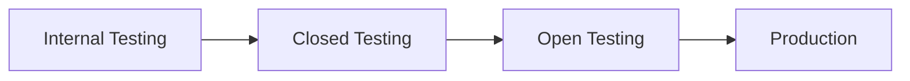

# Google Play Internal Testing Guide

## 🤖 Android Beta Testing Setup

### Prerequisites
- [ ] Google Play Developer Account ($25 one-time)
- [ ] Play Console access
- [ ] Android Studio installed
- [ ] Play App Signing enrolled
- [ ] Upload key generated

---

## 🔨 Build Configuration

### 1. App Build Settings

```gradle
// app/build.gradle
android {
    defaultConfig {
        applicationId "app.babyshield.android"
        minSdkVersion 23        // Android 6.0
        targetSdkVersion 33     // Android 13
        versionCode 100
        versionName "1.0.0"
    }
    
    signingConfigs {
        release {
            storeFile file(RELEASE_STORE_FILE)
            storePassword RELEASE_STORE_PASSWORD
            keyAlias RELEASE_KEY_ALIAS
            keyPassword RELEASE_KEY_PASSWORD
        }
    }
    
    buildTypes {
        release {
            minifyEnabled true
            proguardFiles getDefaultProguardFile('proguard-android-optimize.txt'), 'proguard-rules.pro'
            signingConfig signingConfigs.release
        }
    }
    
    bundle {
        language {
            enableSplit = true
        }
        density {
            enableSplit = true
        }
        abi {
            enableSplit = true
        }
    }
}
```

### 2. Generate App Bundle

```bash
# Clean project
./gradlew clean

# Build release AAB (App Bundle)
./gradlew bundleRelease

# Output location
# app/build/outputs/bundle/release/app-release.aab

# Verify AAB
bundletool build-apks \
  --bundle=app-release.aab \
  --output=test.apks \
  --mode=universal
```

### 3. ProGuard Configuration

```proguard
# proguard-rules.pro
-keepattributes Signature
-keepattributes *Annotation*

# Keep model classes
-keep class app.babyshield.models.** { *; }

# Retrofit
-keepattributes Signature, InnerClasses, EnclosingMethod
-keepclassmembers,allowshrinking,allowobfuscation interface * {
    @retrofit2.http.* <methods>;
}

# Crashlytics
-keepattributes SourceFile,LineNumberTable
-keep public class * extends java.lang.Exception
```

---

## 📤 Upload to Play Console

### Method 1: Play Console Web

1. Open [Play Console](https://play.google.com/console)
2. Select your app
3. Testing → Internal testing
4. Create new release
5. Upload AAB file
6. Add release notes
7. Review and roll out

### Method 2: Play Console API

```python
# upload_to_play.py
from googleapiclient.discovery import build
from googleapiclient.http import MediaFileUpload

def upload_aab():
    service = build('androidpublisher', 'v3')
    package_name = 'app.babyshield.android'
    
    # Create edit
    edit = service.edits().insert(
        packageName=package_name
    ).execute()
    
    edit_id = edit['id']
    
    # Upload AAB
    aab_file = MediaFileUpload('app-release.aab', mimetype='application/octet-stream')
    upload = service.edits().bundles().upload(
        packageName=package_name,
        editId=edit_id,
        media_body=aab_file
    ).execute()
    
    version_code = upload['versionCode']
    
    # Assign to internal track
    service.edits().tracks().update(
        packageName=package_name,
        editId=edit_id,
        track='internal',
        body={
            'releases': [{
                'versionCodes': [version_code],
                'status': 'completed',
                'releaseNotes': [{
                    'language': 'en-US',
                    'text': 'Bug fixes and improvements'
                }]
            }]
        }
    ).execute()
    
    # Commit edit
    service.edits().commit(
        packageName=package_name,
        editId=edit_id
    ).execute()
```

### Method 3: Gradle Play Publisher

```gradle
// build.gradle
plugins {
    id 'com.github.triplet.play' version '3.8.4'
}

play {
    serviceAccountCredentials = file("play-service-account.json")
    track = "internal"
    releaseStatus = "completed"
    defaultToAppBundles = true
}
```

```bash
# Upload with gradle
./gradlew publishBundle
```

---

## ⚙️ Internal Testing Configuration

### 1. Testing Track Setup

```yaml
Track: Internal Testing
  
Settings:
  Max Testers: 100
  Release Review: Not required
  
Availability:
  Countries: All
  Device exclusions: None
  
Feedback:
  Email: android-beta@babyshield.app
  URL: https://babyshield.app/android-feedback
```

### 2. Tester Management

#### Add Testers by Email

```csv
# internal_testers.csv
beta1@babyshield.app
beta2@babyshield.app
qa-team@babyshield.app
```

1. Testing → Internal testing
2. Testers tab
3. Create email list
4. Add email addresses
5. Save

#### Tester Lists

```yaml
Lists:
  - Development Team (10 testers)
  - QA Team (20 testers)
  - Product Team (5 testers)
  - Beta Volunteers (65 testers)
```

### 3. Test Link Distribution

```
https://play.google.com/apps/internaltest/[UNIQUE_ID]
```

Share via:
- Email to testers
- Slack/Teams
- Internal wiki
- QR code

---

## 📱 Testing Tracks Progression

### Track Hierarchy



### Internal Testing (First)
- 100 testers max
- Instant releases
- No review required
- Best for: Core team, daily builds

### Closed Testing (Alpha/Beta)
- Unlimited testers
- Controlled access
- Country restrictions available
- Best for: Extended team, weekly builds

### Open Testing
- Unlimited testers
- Public opt-in
- Play Store listing preview
- Best for: Public beta, RC builds

---

## 🧪 Pre-Launch Report

### Automated Testing

Play Console automatically tests your app on real devices:

```yaml
Test Coverage:
  Devices: 5-15 different models
  Languages: Your supported languages
  
Tests Performed:
  - Installation
  - Launch
  - Basic navigation
  - Monkey testing
  - Screenshots
  
Results:
  - Crashes
  - ANRs (App Not Responding)
  - Security vulnerabilities
  - Accessibility issues
  - Performance metrics
```

### Review Pre-Launch Report

1. Play Console → Testing → Pre-launch report
2. Review issues by severity
3. Fix critical issues
4. Re-test with new build

---

## 📊 Testing Metrics

### Key Performance Indicators

```yaml
Metrics Dashboard:
  
  Stability:
    - Crash rate: < 1%
    - ANR rate: < 0.5%
    
  Adoption:
    - Install rate: > 80%
    - Active testers: > 50%
    
  Engagement:
    - Sessions per user: > 3
    - Feedback submissions: > 10%
    
  Technical:
    - App size: < 50MB
    - Startup time: < 3s
    - Battery usage: Normal
```

### Vitals Monitoring

```yaml
Android Vitals:
  
  Core Vitals:
    - Crash rate ✓
    - ANR rate ✓
    - Stuck wake locks
    - Excessive wakeups
    
  Quality Signals:
    - Render time
    - App startup time
    - Permission denials
    - Battery usage
```

---

## 💬 Feedback Management

### In-App Feedback

```kotlin
// FeedbackActivity.kt
class FeedbackHelper {
    fun requestInAppReview(activity: Activity) {
        val manager = ReviewManagerFactory.create(activity)
        val request = manager.requestReviewFlow()
        
        request.addOnCompleteListener { task ->
            if (task.isSuccessful) {
                val reviewInfo = task.result
                val flow = manager.launchReviewFlow(activity, reviewInfo)
                flow.addOnCompleteListener { _ ->
                    // Review flow finished
                }
            }
        }
    }
}
```

### Feedback Response Template

```markdown
Subject: Re: BabyShield Beta Feedback

Hi [Tester],

Thank you for testing BabyShield and providing feedback about [issue].

[Specific response to feedback]

This will be addressed in build [XXX] coming [timeframe].

Keep the feedback coming!

Best,
BabyShield Android Team
```

---

## 🔄 Release Management

### Version Code Strategy

```kotlin
// Automated version code
def getVersionCode() {
    def code = project.hasProperty('versionCode') ? 
               project.property('versionCode').toInteger() : 
               100
    return code
}

// Build number from CI
def getBuildNumber() {
    return System.getenv("BUILD_NUMBER") ?: "1"
}

android {
    defaultConfig {
        versionCode getVersionCode() + getBuildNumber().toInteger()
        versionName "1.0.0"
    }
}
```

### Release Notes Template

```markdown
## What's New in Build [XXX]

### New Features
- Enhanced barcode scanning accuracy
- Faster search results
- Improved offline mode

### Bug Fixes
- Fixed crash on Android 6.0 devices
- Resolved login issues
- Fixed notification delays

### Known Issues
- [List any known issues]

Please test all features and report issues to android-beta@babyshield.app
```

---

## 🚨 Common Issues & Solutions

### Issue: Upload Failed - Version Code

```yaml
Error: Version code already exists

Solution:
  - Increment versionCode in build.gradle
  - Clean and rebuild
  - Use unique version codes for each upload
```

### Issue: AAB Too Large

```yaml
Error: App Bundle size exceeds limit

Solutions:
  - Enable resource shrinking
  - Use App Bundle format (not APK)
  - Implement dynamic feature modules
  - Optimize images and assets
```

### Issue: Target SDK Warning

```yaml
Warning: Target SDK version too old

Solution:
  - Update targetSdkVersion to 33+
  - Test on latest Android version
  - Update dependencies
```

### Issue: Signing Configuration

```yaml
Error: App not signed correctly

Solution:
  - Enroll in Play App Signing
  - Use upload certificate
  - Verify keystore configuration
  - Check certificate fingerprint
```

---

## 📱 Testing Best Practices

### Device Coverage

```yaml
Priority Devices:
  High:
    - Samsung Galaxy S series
    - Google Pixel phones
    - OnePlus devices
    
  Medium:
    - Xiaomi phones
    - Motorola devices
    - LG phones
    
  Low:
    - Tablets
    - Android TV
    - Wear OS
```

### Android Versions

```yaml
Minimum Coverage:
  - Android 6.0 (API 23): 5%
  - Android 7.0 (API 24): 10%
  - Android 8.0 (API 26): 15%
  - Android 9.0 (API 28): 20%
  - Android 10 (API 29): 20%
  - Android 11 (API 30): 15%
  - Android 12 (API 31): 10%
  - Android 13 (API 33): 5%
```

---

## 🎯 Testing Checklist

### Before Release
- [ ] Version code incremented
- [ ] Target SDK current (33+)
- [ ] ProGuard rules updated
- [ ] Permissions justified
- [ ] Release notes written

### Testing Coverage
- [ ] Fresh install tested
- [ ] Upgrade tested
- [ ] All features working
- [ ] Offline mode tested
- [ ] Different screen sizes
- [ ] Accessibility tested

### Performance
- [ ] App size < 50MB
- [ ] Startup time < 3s
- [ ] No memory leaks
- [ ] Battery usage normal
- [ ] Network usage optimized

---

## 🚀 Promoting to Production

### Graduation Path

1. **Internal Testing** (1-2 weeks)
   - Core team testing
   - Major bug fixes
   - Feature validation

2. **Closed Testing** (2-3 weeks)
   - Extended team
   - Performance testing
   - Localization testing

3. **Open Testing** (1-2 weeks)
   - Public beta
   - Stress testing
   - Final polish

4. **Staged Rollout** (1 week)
   - 5% → 10% → 25% → 50% → 100%
   - Monitor vitals
   - Respond to feedback

5. **Full Production**
   - 100% rollout
   - Marketing launch
   - Press release

---

## 📈 Success Metrics

### Internal Testing Goals
- 90% of testers active
- < 1% crash rate
- < 0.5% ANR rate
- 50+ feedback items
- All critical bugs fixed

### Ready for Production
- Pre-launch report: Pass
- Vitals: All green
- Reviews: 4.0+ stars
- Crashes: < 0.5%
- Retention: > 60% (Day 1)

---

**Last Updated:** January 2024  
**Next Review:** Before major release
