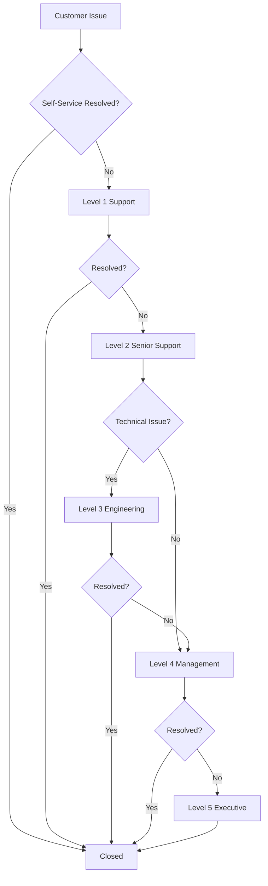
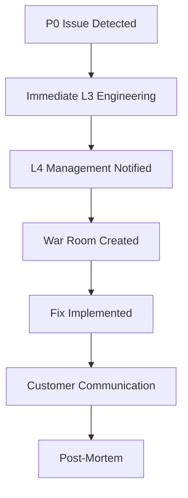

# Support Escalation Matrix

## 🎯 Overview
Clear escalation paths for different types of support issues to ensure timely resolution.

---

## 📊 Escalation Levels

### Level 0: Self-Service
**Who:** Customer
**Resources:**
- FAQ: https://babyshield.app/faq
- Help Center: https://help.babyshield.app
- Community Forum: https://community.babyshield.app
**Escalates to:** Level 1 via in-app feedback or email

### Level 1: Frontline Support
**Who:** Support Agents
**Handles:**
- General inquiries
- Account issues
- Basic troubleshooting
- Feature questions
**Response Time:** 
- P2: 4 hours
- P3: 8 hours
**Escalates When:**
- Technical issue beyond documentation
- Customer dissatisfied after 2 exchanges
- Security/privacy concern raised
- Bug requires engineering input

### Level 2: Senior Support
**Who:** Senior Support Specialists
**Handles:**
- Complex account issues
- Subscription/billing problems
- Bug triage and reproduction
- L1 escalations
**Response Time:**
- P1: 2 hours
- P2: 4 hours
**Escalates When:**
- P0 critical issue identified
- Legal/compliance question
- Data integrity issue
- Customer threatens public action

### Level 3: Engineering Team
**Who:** On-call Engineers
**Handles:**
- Bug fixes
- Performance issues
- Data corrections
- Infrastructure problems
**Response Time:**
- P0: 1 hour
- P1: 2 hours
**Escalates When:**
- System-wide outage
- Security breach suspected
- Executive visibility needed
- Major product decision required

### Level 4: Management
**Who:** Support Manager → Director → VP
**Handles:**
- P0 incidents
- Customer complaints to executives
- Legal threats
- Media inquiries
**Response Time:**
- P0: Immediate
- P1: 30 minutes
**Escalates When:**
- CEO/Board involvement needed
- Regulatory compliance issue
- Major PR situation

### Level 5: Executive
**Who:** C-Suite
**Handles:**
- Crisis management
- Strategic decisions
- Legal actions
- Media responses
**Response Time:** Immediate

---

## 🔄 Escalation Workflows

### Standard Escalation Flow


### Emergency Escalation (P0)


---

## 🚨 Escalation Triggers

### Automatic Escalation
| Condition | Escalates To | Timeframe |
|-----------|--------------|-----------|
| No L1 response | L2 Senior | 4 hours |
| No L2 response | L3 Engineering | 2 hours |
| P0 detected | L3 + L4 | Immediate |
| 3+ customers same issue | L2 Senior | Immediate |
| Security keyword | L3 Security Team | Immediate |
| Legal threat | L4 Management | Immediate |
| Media mention | L4 Management | 30 minutes |

### Manual Escalation Criteria
- Customer explicitly requests manager
- Agent unable to resolve after 3 attempts
- Issue requires code change
- Policy exception needed
- Compensation > $100 required

---

## 📞 Escalation Contacts

### Frontline Support (L1)
- **Queue:** support@babyshield.app
- **Slack:** #support-team
- **Hours:** 9 AM - 6 PM EST

### Senior Support (L2)
- **Lead:** sarah.johnson@babyshield.app
- **Slack:** #support-escalations
- **Phone:** Extension 102

### Engineering (L3)
- **On-Call:** oncall@babyshield.app
- **PagerDuty:** babyshield-eng
- **Slack:** #engineering-oncall

### Management (L4)
- **Support Manager:** mike.chen@babyshield.app
- **Mobile:** +1-555-0101
- **Director CS:** lisa.williams@babyshield.app
- **Mobile:** +1-555-0102

### Executive (L5)
- **VP Customer Success:** john.smith@babyshield.app
- **Mobile:** +1-555-0103
- **CTO:** alex.kumar@babyshield.app
- **Mobile:** +1-555-0104
- **CEO:** emma.davis@babyshield.app
- **Mobile:** +1-555-0105

---

## 🔔 Notification Templates

### L1 → L2 Escalation
```
Subject: [ESCALATION] Ticket #[NUMBER] - [ISSUE]

Escalating to Senior Support

Ticket: #[NUMBER]
Customer: [NAME]
Issue: [BRIEF DESCRIPTION]
Attempts: [NUMBER] responses sent
Reason: [Why escalating]

Customer Context:
[Relevant details]

Actions Taken:
[What was tried]

Next Steps Needed:
[What senior support should do]
```

### L2 → L3 Engineering Escalation
```
Subject: [ENGINEERING NEEDED] Ticket #[NUMBER] - [ISSUE]

Technical investigation required

Ticket: #[NUMBER]
Priority: [P0/P1/P2]
Affected Users: [NUMBER/All]
Component: [Area of system]

Issue Description:
[Technical details]

Reproduction Steps:
1. [Step]
2. [Step]

Logs/Errors:
[Relevant technical info]

Business Impact:
[Why urgent]
```

### L3 → L4 Management Escalation
```
Subject: [MANAGEMENT ATTENTION] P[0/1] - [ISSUE]

Management decision required

Situation:
[Brief summary]

Impact:
- Affected users: [NUMBER]
- Revenue impact: $[AMOUNT]
- Brand risk: [HIGH/MEDIUM/LOW]

Options:
1. [Option with pros/cons]
2. [Option with pros/cons]

Recommendation:
[What we suggest]

Decision Needed By: [TIME]
```

---

## 📈 Escalation Metrics

### Target Metrics
| Metric | Target | Measurement |
|--------|--------|-------------|
| L1 Resolution Rate | >70% | % resolved without escalation |
| Escalation Rate | <15% | % of tickets escalated |
| Re-escalation Rate | <5% | % escalated multiple times |
| Time to Escalate | <30 min | Average decision time |
| Escalation Success | >90% | % resolved after escalation |

### Red Flags (Require Review)
- Same issue escalated 3+ times in a week
- Customer escalated 2+ times for same ticket
- L1 agent escalation rate >25%
- P0 not resolved within 4 hours
- Executive escalation from social media

---

## 🛠️ Escalation Tools

### Internal Tools
- **Ticket System:** Zendesk/Freshdesk
- **Escalation Queue:** priority@babyshield.app
- **War Room:** Slack #incident-response
- **Status Page:** status.babyshield.app
- **Runbook:** wiki.babyshield.app/runbooks

### Communication Channels
- **Urgent:** Phone call + Slack
- **High:** Slack + Email
- **Normal:** Email + Ticket update
- **FYI:** Ticket note

---

## 📚 Escalation Best Practices

### DO's
✅ Document everything in ticket
✅ Set clear expectations with customer
✅ Warm handoff with context
✅ Follow up after resolution
✅ Update knowledge base
✅ Thank previous level for escalation

### DON'Ts
❌ Escalate without attempting resolution
❌ Skip levels except for P0
❌ Blame other teams
❌ Promise what you can't deliver
❌ Forget to close the loop
❌ Leave customer uninformed

---

## 🔄 De-escalation Techniques

### When Customer Demands Escalation
1. **Acknowledge:** "I understand you'd like to speak with a manager"
2. **Empathize:** "I can see this has been frustrating"
3. **Attempt:** "Let me try one more thing that often works"
4. **Offer:** "I can escalate, but it may take [TIME]"
5. **Escalate:** If still needed, do so gracefully

### Common De-escalation Phrases
- "I completely understand your frustration"
- "Let me personally ensure this gets resolved"
- "I'm going to take ownership of this issue"
- "What would a good resolution look like to you?"
- "I have the authority to help you with this"

---

## 📊 Weekly Escalation Review

### Agenda (Every Monday 10 AM)
1. Review previous week's escalations
2. Identify patterns/trends
3. Update runbooks for common issues
4. Training needs assessment
5. Process improvements
6. Recognition for good escalations

### Participants
- Support Manager (Lead)
- Senior Support Specialists
- Engineering Representative
- Product Manager (monthly)

---

**Document Version:** 1.0.0  
**Last Updated:** January 2024  
**Review Cycle:** Monthly  
**Owner:** Support Operations
