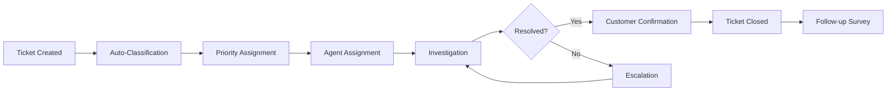

# BabyShield Support Service Level Agreement (SLA)

## 📋 Overview

**Effective Date:** January 2024  
**Version:** 1.0.0  
**Contact:** support@babyshield.app

This Service Level Agreement outlines our commitment to providing exceptional support to BabyShield users.

---

## ⏱️ Response Time Commitments

### Support Channels & Response Times

| Channel | Initial Response | Resolution Target | Hours of Operation |
|---------|-----------------|-------------------|-------------------|
| **Critical (P0)** | 1 hour | 4 hours | 24/7 |
| **High (P1)** | 2 hours | 8 hours | 24/7 |
| **Medium (P2)** | 4 hours | 24 hours | Business hours |
| **Low (P3)** | 8 hours | 48 hours | Business hours |
| **Feature Request** | 24 hours | N/A | Business hours |

**Business Hours:** Monday-Friday, 9:00 AM - 6:00 PM EST  
**Holidays:** US Federal holidays excluded from business hours

---

## 🚨 Priority Definitions

### P0 - Critical (System Down)
**Definition:** Complete service outage or critical security issue affecting all users

**Examples:**
- API completely unavailable
- Database corruption or data loss
- Security breach or vulnerability
- Payment processing failure for all users

**Response:** Immediate escalation, all-hands response

### P1 - High (Major Impact)
**Definition:** Significant functionality broken affecting many users

**Examples:**
- Search feature not working
- Barcode scanning failures
- Authentication issues for subset of users
- Incorrect recall data displayed

**Response:** Priority queue, dedicated engineer assigned

### P2 - Medium (Limited Impact)
**Definition:** Non-critical feature issues or performance degradation

**Examples:**
- Slow response times (>3 seconds)
- UI display issues
- Non-critical feature bugs
- Account settings not saving

**Response:** Standard queue, addressed in order

### P3 - Low (Minor Issue)
**Definition:** Cosmetic issues or minor inconveniences

**Examples:**
- Typos or text issues
- Minor UI inconsistencies
- Feature enhancement requests
- Documentation questions

**Response:** Batch processing, addressed during maintenance

---

## 📊 Performance Metrics

### Target Service Levels

| Metric | Target | Measurement |
|--------|--------|-------------|
| **First Response Rate** | 95% within SLA | Monthly average |
| **Resolution Rate** | 90% within target | Monthly average |
| **Customer Satisfaction** | >4.5/5.0 | CSAT surveys |
| **Ticket Backlog** | <100 open tickets | Weekly snapshot |
| **Escalation Rate** | <10% of tickets | Monthly average |

### Uptime Commitments

| Service | Uptime Target | Measurement Period |
|---------|---------------|-------------------|
| **API Availability** | 99.9% | Monthly |
| **Search Functionality** | 99.5% | Monthly |
| **Authentication** | 99.9% | Monthly |
| **Database** | 99.95% | Monthly |

**Exclusions:**
- Scheduled maintenance (communicated 48 hours in advance)
- Force majeure events
- Third-party service failures

---

## 🎯 Support Channels

### Primary Channels

#### 1. In-App Feedback
- **Access:** Settings → Help & Support → Contact Us
- **Response:** Within SLA based on priority
- **Best for:** Bug reports, feature requests

#### 2. Email Support
- **Address:** support@babyshield.app
- **Response:** Within 24 hours
- **Best for:** Account issues, general inquiries

#### 3. Twitter/X Support
- **Handle:** @BabyShieldHelp
- **Response:** Within 4 hours during business hours
- **Best for:** Quick questions, status updates

#### 4. Emergency Hotline
- **Number:** 1-800-BABY-SAFE (P0 issues only)
- **Availability:** 24/7
- **Best for:** Critical security or safety issues

### Self-Service Resources

- **Help Center:** https://help.babyshield.app
- **FAQ:** https://babyshield.app/faq
- **Status Page:** https://status.babyshield.app
- **Community Forum:** https://community.babyshield.app

---

## 📈 Escalation Matrix

### Level 1: Frontline Support
**Handles:** P2, P3 issues
**Escalates when:**
- Unable to resolve within 30 minutes
- Customer requests escalation
- Security concern identified

### Level 2: Senior Support
**Handles:** P1 issues, L1 escalations
**Escalates when:**
- P0 issue identified
- Legal/compliance concern
- Engineering involvement needed

### Level 3: Engineering Team
**Handles:** Technical issues, bugs
**Escalates when:**
- Infrastructure issue
- Data integrity concern
- Executive visibility needed

### Level 4: Management
**Handles:** P0 issues, critical decisions
**Involves:**
- CTO for technical decisions
- CEO for business impact
- Legal for compliance issues

---

## 📝 Support Process

### Ticket Lifecycle



### Standard Operating Procedures

1. **Acknowledgment**
   - Send auto-response within 1 minute
   - Include ticket number and expected response time

2. **Classification**
   - Determine priority level
   - Assign appropriate category
   - Route to correct team

3. **Investigation**
   - Review user account details
   - Check recent system changes
   - Reproduce issue if possible

4. **Resolution**
   - Provide clear solution
   - Document steps taken
   - Update knowledge base if needed

5. **Verification**
   - Confirm issue resolved
   - Ask for customer confirmation
   - Provide additional resources

6. **Closure**
   - Close ticket after confirmation
   - Send satisfaction survey
   - Archive for future reference

---

## 💬 Communication Standards

### Response Templates

#### Initial Acknowledgment
```
Hi [Name],

Thank you for contacting BabyShield Support. We've received your message and assigned it ticket #[NUMBER].

Priority: [P0/P1/P2/P3]
Expected Response: Within [TIME]

We'll investigate and get back to you shortly.

Best regards,
BabyShield Support Team
```

#### Status Update
```
Hi [Name],

Quick update on ticket #[NUMBER]:

Current Status: [Status]
Progress: [Details]
Next Steps: [Actions]
ETA: [Timeline]

Thank you for your patience.

Best regards,
[Agent Name]
```

#### Resolution
```
Hi [Name],

Good news! We've resolved the issue you reported in ticket #[NUMBER].

Resolution: [Details]
Actions Taken: [List]

Please confirm the issue is resolved on your end. If you need anything else, just let us know.

Best regards,
[Agent Name]
```

### Tone Guidelines

- **Empathetic:** Acknowledge frustration
- **Professional:** Maintain respectful tone
- **Clear:** Use simple language
- **Proactive:** Offer additional help
- **Personal:** Use customer's name

---

## 🔄 Continuous Improvement

### Weekly Reviews
- Ticket volume analysis
- Response time metrics
- Common issue patterns
- Team performance

### Monthly Reviews
- SLA compliance
- Customer satisfaction trends
- Process improvements
- Knowledge base updates

### Quarterly Reviews
- SLA adjustments
- Team training needs
- Tool evaluation
- Strategic planning

---

## 📊 Reporting

### Daily Reports
- Open ticket count
- P0/P1 status
- SLA violations
- Team availability

### Weekly Reports
- Resolution metrics
- Customer feedback
- Trending issues
- Performance summary

### Monthly Reports
- SLA compliance report
- CSAT scores
- Root cause analysis
- Improvement recommendations

---

## 🤝 Customer Commitments

### We Promise To:
1. **Respond promptly** within stated SLAs
2. **Communicate clearly** with regular updates
3. **Resolve efficiently** with minimal back-and-forth
4. **Follow up** to ensure satisfaction
5. **Learn continuously** from feedback

### We Ask You To:
1. **Provide details** about issues
2. **Include screenshots** when relevant
3. **Respond to questions** promptly
4. **Be patient** during investigation
5. **Share feedback** on service quality

---

## 📞 Contact Information

### Support Team
- **Email:** support@babyshield.app
- **Phone:** 1-800-BABY-SAFE
- **Hours:** 24/7 for critical issues

### Escalation Contacts
- **Support Manager:** manager@babyshield.app
- **Director of Support:** director@babyshield.app
- **VP Customer Success:** vp-success@babyshield.app

### Legal & Compliance
- **Privacy:** privacy@babyshield.app
- **Security:** security@babyshield.app
- **Legal:** legal@babyshield.app

---

## 📋 SLA Exclusions

### Not Covered
- Beta features marked as experimental
- Third-party integrations
- Customer-caused issues
- Force majeure events
- Scheduled maintenance

### Credits & Compensation
- Service credits for extended outages
- Pro-rated refunds for paid features
- Priority support for affected users
- Detailed post-mortem reports

---

**Last Updated:** January 2024  
**Next Review:** April 2024  
**Owner:** Customer Success Team
